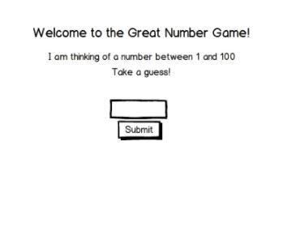

# Python_Great_number_game
"I'm thinking of a number between 1 and 100..."

This is  a site that allows a user to play this guessing game. Upon loading, the server should "pick" a random number between 1-100; store the number in session. Allow the user to guess the number--tell them when they are too high or too low. If they guess the correct number, notify them and offer to play again.

